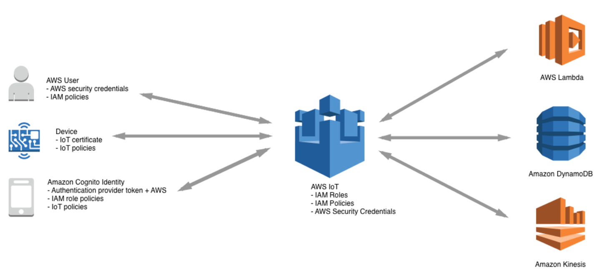
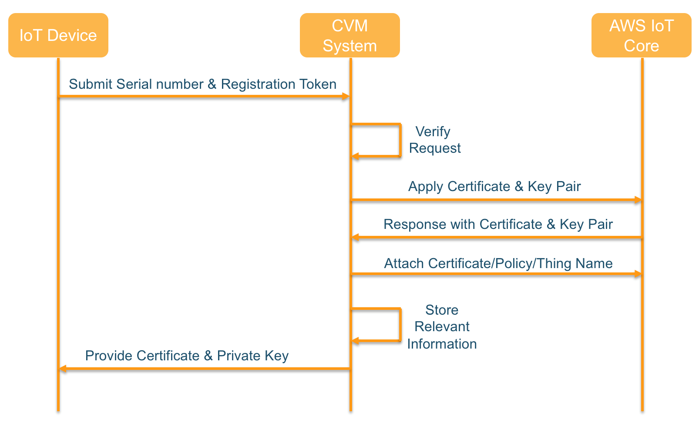
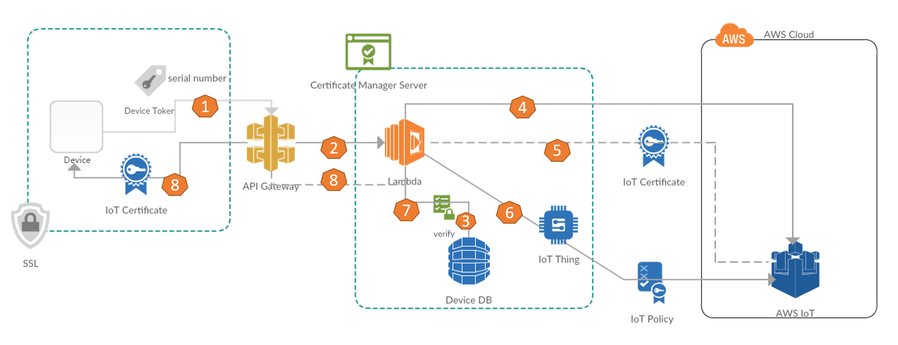
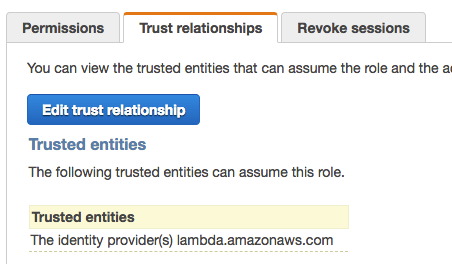

## AWS Iot Certificate Vending Machine

You can use the CVM allows the device to apply for their own certificate and installation.

#### Background Information

In order to ensure the secured communication between IoT devices and AWS IoT Core, Devices may use X.509 certificates to connect to AWS IoT using TLS mutual authentication protocols. AWS Cloud security mechanisms protect data as it moves between AWS IoT and other devices or AWS services.



This mutual TLS authentication mode requires that a device certificate meets either of the following two conditions:

1.	The certificate used on the IoT device is issued by AWS IoT Core
2.	The CA certificate which is used to sign IoT device certificate is pre-imported into a customer’s AWS account and associated with their AWS IoT Core environment
AWS understands that customers will have devices that currently do not have the ability to meet condition 1 or 2 immediately. Therefore, we have provided a reference application called, Certificate Vending Machine, which demonstrates how customers can provision devices with certificates created in AWS IoT.


#### When to use Certificate Vending Machine?

Certificate Vending Machine (CVM) is an ideal fit for customers who do not have certificates pre-installed on the devices and are unable to obtain CA certificates to pre-create device certificates during their manufacturing process. On this occasion, you can use CVM system which allows the device to apply for their own certificate and then install the certificate into storage on the device. This document provides the design ideas and associated source code, which can help customers quickly develop a CVM system. Since the original IoT device does not contain a certificate for TLS mutual authentication, we need to pay attention to three points.

•	When IoT devices and the CVM system are communicating, a trusted DNS environment is needed in order to prevent the man-in-middle attack along with using other secured communication method, such as HTTPS.
•	When an IoT device requests a certificate, it should have a unique identifier.  The identifier, such as serial number, client ID or product ID, will be used for policy binding and to ensure that the device is a valid device.
•	All certificates submitted by the CVM system are AWS IoT Core signed certificates. If you need to use a custom CA certificate, refer to the Just-in-time Registration (JITR) certificate authentication method.

#### Implementation Methodology

The entire implementation can be divided into three modules: IoT devices, CVM system and AWS IoT Core.

•	IoT device side
•	Request a device certificate via HTTPS connection.
•	Submit the device serial number and the registration token when requested. Registration token is a one-time token to avoid device serial number spoofing.
•	CVM system
•	Provides remote access to IoT devices for certificate application.
•	Generates secured certificate for each IoT device that can be used to communicate to AWS IoT Core.
•	Uses database, like DynamoDB, to store information such as the device ID, key registration information, and the applied device certificate.
•	Associates IoT Thing Name, Certificate Policy, and Certificate ID by querying the association table in DynamoDB. In parallel, CVM modifies the certificate status attribute in DynamoDB to ensure that a device can only register for a single active certificate.
•	IoT Core
•	Response to API calls to generate the certificate and key pairs.


The basic workflow of the CVM system is as follows:



The architecture of CVM system is as follows:



Using the API Gateway and Lambda solution for scalability, the detailed workflow is shown as follows: 

1)	When IoT device requests access to IoT platform, it triggers a certificate application to CVM system. Then IoT device sends the appropriate API calls to the API Gateway for IoT device certificate application.
2)	AWS API Gateway invokes Lambda to initiate certificate request to IoT Core. 
3)	After receiving the request from API Gateway, Lambda checks DynamoDB to validate if the request is legitimate and applies for a certificate to the backend IoT Core.
4)	The CVM system uses the AWS SDK to make a series of API calls to AWS IoT Core. These API calls perform actions such as creating a new thing in the AWS IoT Thing Registry and creating an associated device certificate. 
5)	AWS IoT Core generates a device certificate, key pairs and returns the certificate information and the certificate ID to CVM system.
6)	Lambda uses a series of API calls to associate Thing Name, Certificate, and Policy on IoT Thing registry by querying pre-created DynamoDB association table according to product serial number.
7)	Update all the associated information of the current device to DynamoDB association table
8)	Lastly, the CVM system returns the certificate to the IoT devices

#### Security

In order to ensure the security of the CVM system, the AWS Lambda function needs to be scoped to the minimum permissions needed in order to create certificates. The following example shows how to assign the correct IAM role privilege to the CVM system. 

First of all, you need to understand the CVM system needs to have the IAM authority to complete the certificate application and the issuance process.

•	Access AWS DynamoDB for querying, modifying, and updating device associations in DynamoDB table
•	Access the IoT platform to apply for IoT device certificates

The policy template for IAM role as follows, you should modify it more specifically for the minimum privilege.

```
{
  "Version": "2012-10-17",
  "Statement": [
    {
      "Effect": "Allow",
      "Resource": "*",
      "Action": [
                "dynamodb:GetItem",
                "dynamodb:Query",
                "dynamodb:PutItem",
                "dynamodb:UpdateItem",
                "iot:CreateKeysAndCertificate",
                "iot:CreateCertificateFromCsr",
                "iot:CreatePolicy",
                "iot:CreatePolicyVersion",
                "iot:CreateThing",
                "iot:CreateThingType",
                "iot:AttachPolicy",
                "iot:AttachThingPricipal",

	]
    }
  ]
}
```


Secondly, you need to allow lambda assume this role by adding trust relationship.



In addition to the IAM authority division, you need to create an association table on DynamoDB for the binding relationship between the device, the certificate and policy. Specifically, you need to create the following database fields in DynamoDB: 

•	Product id: IoT device ID 
•	Access Token: IoT Token 
•	timestamp: certificate request timestamp
•	applyState: request status (if the certificate is set to -1, it means that the device has already registered the certificate) 
•	certID: certificate ID associated with the device

## How do I deploy this?

#### 1. Deploy the pipeline to your AWS account

The solution is available as a [AWS CloudFormation](https://aws.amazon.com/cloudformation) template, and included in this repository ([template.yml](template.yml)). Click the following button to deploy it to your AWS account in the `us-east-1` region:
 
[](https://console.aws.amazon.com/cloudformation/home?region=us-east-1#/stacks/new?stackName=\<myapp>-pipeline&templateURL=https://s3.amazonaws.com/pubz/cvm.yml)  

You will need to provide some parameters to point [AWS Lambda](https://aws.amazon.com/lambda).

#### Code Description

The following CVM system reference source code uses the IoT interface provided by the AWS Node.js SDK to complete the certificate request and add the associated Thing Name and Policy.

```
//Use createKeysAndCertificate to create certificate，This API will response certificate and certificate ID
iot.createKeysAndCertificate (params = {}, callback) ⇒ AWS.Request

# if CSR is in use, you can use following API call
# iot.createCertificateFromCsr(params = {}, callback) ⇒ AWS.Request

 //Attach policy to current certificate
iot.attachPrincipalPolicy(params = {}, callback) ⇒ AWS.Request

//Attach IoT thing name to current certificat
iot.attachThingPrincipal(params = {}, callback) ⇒ AWS.Request
```

CVM Server side source code on Lambda:
https://github.com/cncoder/cvm/tree/serverless/server

IoT device source code:
https://github.com/cncoder/cvm/tree/serverless/device

#### Reference Link:

http://docs.aws.amazon.com/AWSJavaScriptSDK/latest/AWS/Iot.html

## License

This library is licensed under the Apache 2.0 License. 
